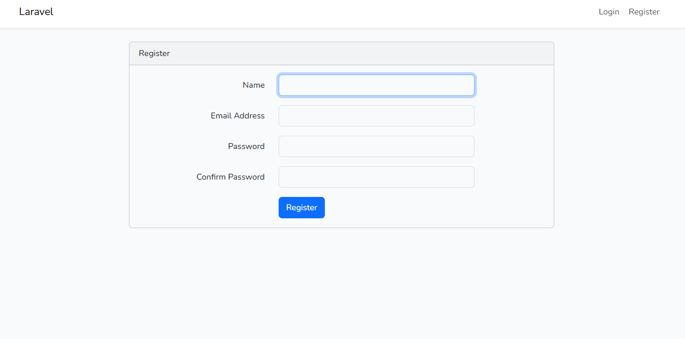

# 🔐 Proyecto Laravel 12 - Sistema de Autenticación

**Elaborado por:** Manuel Guillén  
**Fecha:** 28/9/2025

---

## 📋 Introducción

Este proyecto implementa un sistema de autenticación completo utilizando **Laravel 12**, siguiendo la arquitectura **MVC (Model-View-Controller)**. El objetivo del laboratorio es demostrar la implementación de un sistema de login y registro de usuarios con las mejores prácticas de Laravel.

### 🏗️ Arquitectura MVC en Laravel

- **📊 Modelos (Models)**: Ubicados en `app/Models/`, representan la lógica de negocio y la estructura de datos. En este caso, el modelo `User` maneja la autenticación de usuarios.

- **🎨 Vistas (Views)**: Ubicadas en `resources/views/`, contienen la lógica de presentación. Incluye vistas para login, registro, dashboard y layouts base.

- **🎮 Controladores (Controllers)**: Ubicados en `app/Http/Controllers/`, manejan la lógica de la aplicación y actúan como intermediarios entre modelos y vistas.

- **🛣️ Rutas (Routes)**: Definidas en `routes/web.php`, establecen las URLs y conectan las peticiones HTTP con los controladores correspondientes.

---

## 🚀 Instalación y Configuración

### ⚙️ Prerrequisitos
- **PHP** 8.2 o superior
- **Composer**
- **Node.js** y **NPM**
- **MySQL** 8.0 o superior
- **Servidor web** (Apache/Nginx) o **Laravel Sail**

### 1️⃣ Instalación de Dependencias

```bash
# Instalar dependencias de PHP
composer install

# Instalar dependencias de Node.js
npm install
```

### 2️⃣ Configuración del Archivo .env

```bash
# Copiar el archivo de configuración de ejemplo
cp .env.example .env

# Generar la clave de aplicación
php artisan key:generate
```

### 3️⃣ Configuración de Base de Datos

```bash
# Crear la base de datos en MySQL
mysql -u root -p
CREATE DATABASE lab2_laravel;
exit

# Ejecutar las migraciones
php artisan migrate
```

### 4️⃣ Compilar Assets Frontend

```bash
# Compilar assets para desarrollo
npm run dev

# O para producción
npm run build
```

### 5️⃣ Iniciar el Servidor

```bash
# Iniciar el servidor de desarrollo
php artisan serve
```

---

## 🔧 Secuencia de Comandos Utilizados

### 🔐 Instalación del Sistema de Autenticación

```bash
# 1. Instalar Laravel UI
composer require laravel/ui

# 2. Generar las vistas de autenticación con Bootstrap
php artisan ui bootstrap --auth

# 3. Instalar dependencias de Node.js
npm install

# 4. Compilar los assets
npm run dev

# 5. Ejecutar migraciones para crear las tablas de autenticación
php artisan migrate
```

### 📊 Comandos de Migración Utilizados

```bash
# Crear migración (ya incluida por defecto)
php artisan make:migration create_users_table

# Ejecutar migraciones
php artisan migrate

# Ver estado de migraciones
php artisan migrate:status

# Rollback de migraciones (si es necesario)
php artisan migrate:rollback

# Generar backup de la base de datos
mysqldump -u root -p lab2_laravel > backup_lab2_laravel.sql
```

---

## 🗄️ Base de Datos

### 🎯 Entorno de Base de Datos
- **Tipo**: MySQL 8.0
- **Nombre de la base de datos**: `lab2_laravel`
- **Configuración**: Definida en el archivo `.env`

### ⚙️ Configuración en .env
```env
DB_CONNECTION=mysql
DB_HOST=127.0.0.1
DB_PORT=3306
DB_DATABASE=lab2_laravel
DB_USERNAME=root
DB_PASSWORD=
```

### 📋 Tablas Creadas

#### 1️⃣ **users**: Almacena información de usuarios
- `id` (Primary Key, Auto Increment)
- `name` (VARCHAR 255)
- `email` (VARCHAR 255, UNIQUE)
- `email_verified_at` (TIMESTAMP NULL)
- `password` (VARCHAR 255, hasheada)
- `remember_token` (VARCHAR 100, NULL)
- `created_at` (TIMESTAMP)
- `updated_at` (TIMESTAMP)

#### 2️⃣ **password_reset_tokens**: Tokens para recuperación de contraseñas
- `email` (VARCHAR 255, Primary Key)
- `token` (VARCHAR 255)
- `created_at` (TIMESTAMP NULL)

#### 3️⃣ **sessions**: Sesiones de usuario
- `id` (VARCHAR 255, Primary Key)
- `user_id` (BIGINT UNSIGNED, Foreign Key)
- `ip_address` (VARCHAR 45, NULL)
- `user_agent` (TEXT, NULL)
- `payload` (LONGTEXT)
- `last_activity` (INTEGER)

### 💾 Backup de Base de Datos

Se generó un respaldo completo de la base de datos MySQL utilizando:

```bash
# Generar backup completo
mysqldump -u root -p lab2_laravel > backup_lab2_laravel.sql

# Restaurar backup (si es necesario)
mysql -u root -p lab2_laravel < backup_lab2_laravel.sql
```

El archivo `backup_lab2_laravel.sql` se incluye en el repositorio como respaldo de la base de datos con la estructura inicial y datos de prueba.

---

## 📸 Resultado del Laboratorio

### 📝 Página de Registro

*Formulario de registro de usuarios en el sistema*

### 🗄️ Base de Datos

*Estructura de la base de datos MySQL del proyecto*

---

## ⚠️ Dificultades y Soluciones

### 🚨 Problema 1: Error de Conexión a MySQL
**Descripción**: Error al ejecutar `php artisan migrate` debido a configuración incorrecta de conexión a MySQL.

**✅ Solución**: 
- Verificar que MySQL esté ejecutándose correctamente
- Verificar que el archivo `.env` tenga la configuración correcta para MySQL
- Asegurar que la base de datos `lab2_laravel` exista
- Verificar credenciales de usuario MySQL
- Ejecutar `php artisan config:clear` antes de las migraciones

### 🚨 Problema 2: Assets No Compilados
**Descripción**: Las vistas de autenticación no mostraban estilos correctamente.

**✅ Solución**:
- Ejecutar `npm install` para instalar dependencias
- Compilar assets con `npm run dev`
- Verificar que los archivos CSS/JS se generen en `public/css` y `public/js`

### 🚨 Problema 3: Configuración de Rutas de Autenticación
**Descripción**: Las rutas de autenticación no funcionaban correctamente.

**✅ Solución**:
- Verificar que `Auth::routes()` esté incluido en `routes/web.php`
- Asegurar que el middleware de autenticación esté configurado correctamente
- Verificar que las vistas estén en las ubicaciones correctas

### 🚨 Problema 4: Permisos de Base de Datos
**Descripción**: Error de permisos al crear tablas en MySQL.

**✅ Solución**:
- Verificar que el usuario MySQL tenga permisos de CREATE, DROP, INSERT, UPDATE, DELETE
- Ejecutar `GRANT ALL PRIVILEGES ON lab2_laravel.* TO 'root'@'localhost';`
- Reiniciar el servicio MySQL si es necesario

---

## 📚 Referencias

1. **📖 Laravel Documentation - Authentication**  
   https://laravel.com/docs/authentication  
   *Documentación oficial de Laravel sobre implementación de autenticación*

2. **📦 Laravel UI Package**  
   https://github.com/laravel/ui  
   *Repositorio oficial del paquete Laravel UI para scaffolding de autenticación*

3. **🗄️ Laravel Database Migrations**  
   https://laravel.com/docs/migrations  
   *Guía oficial sobre migraciones de base de datos en Laravel*

4. **🎨 Bootstrap Documentation**  
   https://getbootstrap.com/docs/5.3/  
   *Documentación de Bootstrap para el diseño de las vistas de autenticación*

5. **🐬 MySQL Documentation**  
   https://dev.mysql.com/doc/  
   *Documentación oficial de MySQL para configuración y administración*

---

## 🏗️ Estructura del Proyecto

```
lab2/
├── app/
│   ├── Http/Controllers/
│   │   ├── Auth/          # Controladores de autenticación
│   │   └── HomeController.php
│   └── Models/
│       └── User.php       # Modelo de usuario
├── database/
│   ├── migrations/        # Archivos de migración
│   └── backup_lab2_laravel.sql  # Backup de MySQL
├── resources/
│   └── views/
│       ├── auth/          # Vistas de login/registro
│       ├── layouts/       # Layouts base
│       └── home.blade.php # Dashboard principal
├── routes/
│   └── web.php           # Rutas de la aplicación
└── public/               # Archivos públicos y assets
```

---

## 🎯 Objetivo del Laboratorio

El objetivo principal de este laboratorio es implementar un sistema de autenticación completo en Laravel, demostrando:

- ✅ Configuración inicial de un proyecto Laravel
- ✅ Implementación de autenticación de usuarios
- ✅ Uso de migraciones para estructura de base de datos
- ✅ Integración de frontend con Bootstrap
- ✅ Manejo de sesiones y middleware
- ✅ Buenas prácticas de desarrollo con Laravel
- ✅ Configuración y administración de base de datos MySQL

---

## 📝 Notas Adicionales

- 🔧 El proyecto utiliza **Laravel 12** con **PHP 8.2+**
- 🔐 La autenticación incluye registro, login, logout y recuperación de contraseña
- 🛡️ Se implementó middleware de autenticación para proteger rutas
- 📱 El diseño es responsive utilizando **Bootstrap 5**
- 🐬 La base de datos **MySQL** proporciona robustez y escalabilidad
- 💾 Se incluye backup completo de la base de datos para respaldo

---

## 🏛️ Información del Estudiante

---


### 📋 Información del Laboratorio

**Este laboratorio ha sido desarrollado por el estudiante de la Universidad Tecnológica de Panamá:**

| Campo | Información |
|-------|-------------|
| **👤 Nombre:** | **Manuel Guillén** |
| **📧 Correo:** | **manuel.guillen1@utp.ac.pa** |
| **📚 Curso:** | **Ing. Web** |
| **👩‍🏫 Instructor del Laboratorio:** | **Ing. Irina Fong** |

---
